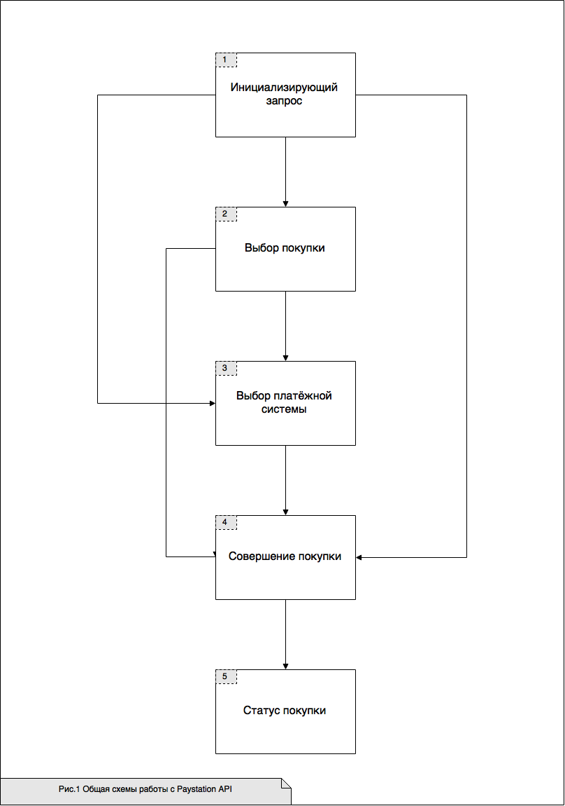
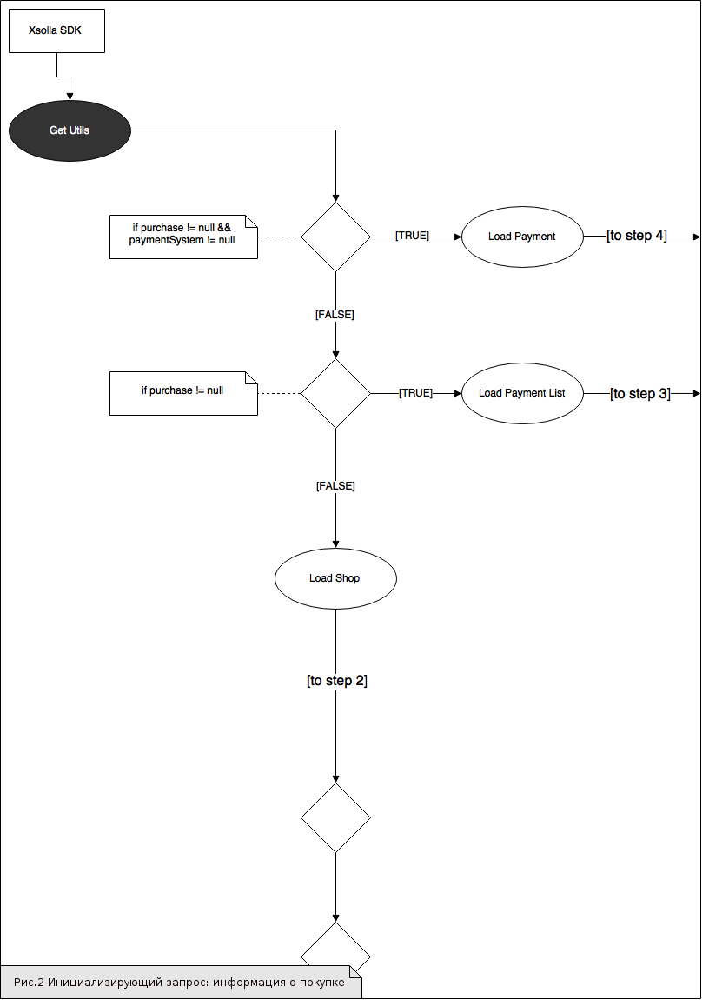
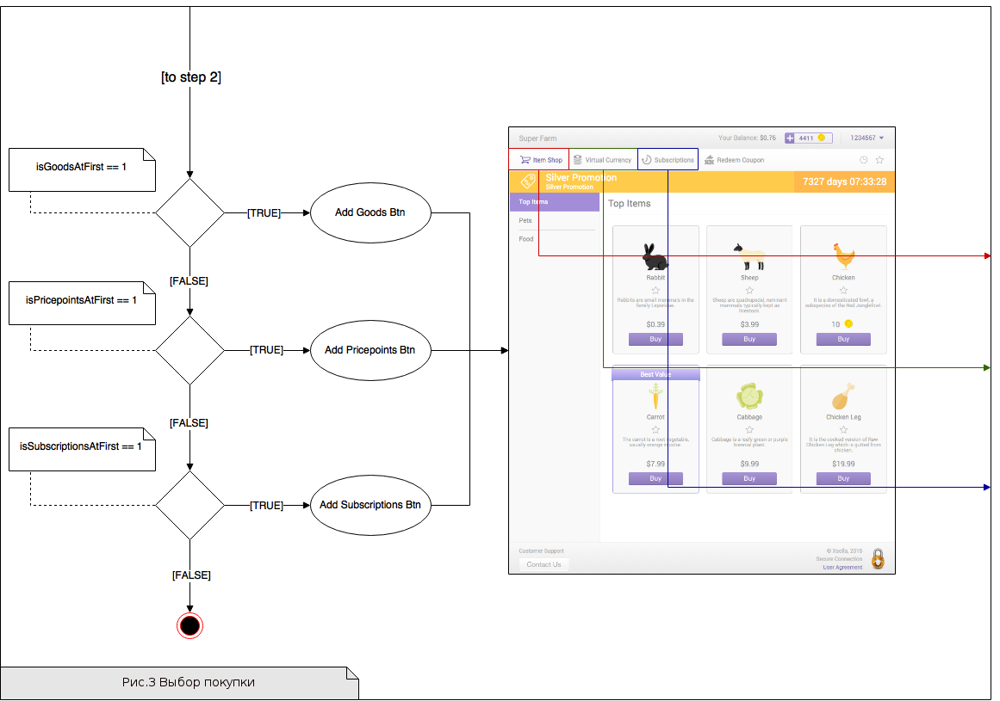
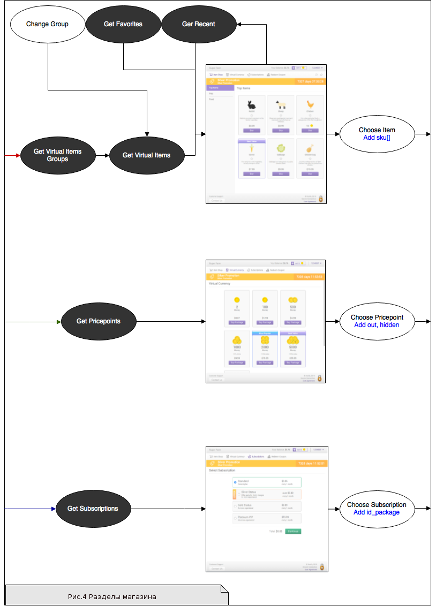
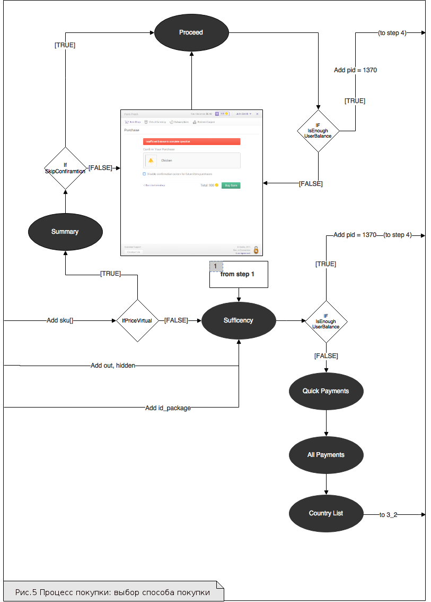

**_Задание 1_**: *Вычитайте, структурируйте и доработайте текст [https://docs.google.com/document/d/1920kvJxC5DQa3xO3XeJhg8tYh1-FPoKFfd5xuiTBruE/edit#](https://docs.google.com/document/d/1920kvJxC5DQa3xO3XeJhg8tYh1-FPoKFfd5xuiTBruE/edit#).  Если исходный текст, на ваш взгляд, не содержит какую-либо необходимую информацию:   
a) укажите, чем надо дополнить исходный текст  
б) приведите пример оформления предполагаемого дополнения.  
*Для выполнения задания скопируйте текст и высылайте уже исправленный вариант. Правки к исходному тексту предлагать не надо.*

**_Комментарий_**: Оригинальный текст не содержит информацию о требованиях к Серверной интеграции.  
а) Я считаю, что в блоке [«Реализация библиотеки»](#abcd) должны быть указаны требования к Серверной интеграции, а также ожидаемый результат интеграции. В данный момент моей квалификации недостаточно, чтобы написать эти требования самостоятельно.  
б) Оформление требований к Серверной интеграции должно быть аналогично оформлению требований к [Упрощенной интеграции](#abce).
# Разработка SDK-библиотеки
Необходимо создать SDK-библиотеку, реализующую функционал магазина на основе Paystation API.  


Цели разработки:
- Упрощение использования платежного решения Xsolla для разработчиков альтернативных платформ;
- Снижение порога вхождения при использовании продукта на конкретной платформе.
## Назначение библиотеки
### Эксплуатационное
- Предоставить разработчикам удобный инструмент, чтобы снизить трудозатраты по внедрению биллингового решения компании Xsolla;
- Улучшить user experience конечного пользователя: инструмент должен быть наглядным, снижать или вовсе исключать дополнительные переходы на другие страницы интерфейса.
### Функциональное
- Назначение библиотеки не должно вызывать вопросов у разработчиков;
- Разработчик должен использовать только один запрос, чтобы получить полный функционал электронного магазина: модули виртуальной валюты, виртуальные товары, подписки и поддержку нескольких методов оплаты;
- Страницы магазина должны быть отрисованы со всеми внутренними взаимодействиями посредством API. Отрисовка должна включать следующие экраны:  
     + экран виртуальных товаров, 
     + экран виртуальной валюты, 
     + экран подписок, 
     + экраны выбора методов оплаты, 
     + экран оплаты, 
     + экран статуса, 
     + экран ошибки.
## Термины и определения
**Токен** – специальная шифрованная строка, необходимая для взаимодействия с Xsolla;  
**JSON** – формат обмена данными между SDK и сервисами Xsolla Paystation;  
**Серверная интеграция** – интеграция и взаимодействие с Xsolla, которые работают через специально настроенный сервер;  
**Упрощённая интеграция** –  интеграция и взаимодействие с Xsolla, которые работают через клиент; сервер игры отсутствует;  
**Header** – блок в верхней части страницы, который виден на всех страницах магазина. Включает в себя, как правило, логотип, меню, контакты, переключатель языков и корзину, а также пункты навигационного меню;  
**Footer** – блок в нижней части страницы, который виден на всех страницах магазина. Содержит полезную, но не первостепенную информацию.
## <a name="abcd"></a>Реализация библиотеки
Необходимо реализовать два варианта взаимодействия с [Paystation API](https://secure.xsolla.com/paystation2/api): в формате `post` или `get` запросов.  
**Вариант 1.** Серверная интеграция – передаётся строка токена;  
**Вариант 2.** Упрощённая интеграция – передаётся текст в формате JSON, вида:   
```
{
"user":{
"id":{
"value":0
},
"name":"",
"email":"",
"country":{
"value":"",
"allow_modify":false
}
},
"settings":{
"project_id":0,
"language":"",
"currency":"",
"mode":"sandbox",
"secretKey":""
}
}
```
### Серверная интеграция
#### Требования к SDK
#### Ожидаемый результат
### <a name="abce"></a>Упрощенная интеграция
#### Требования к SDK
- Создание специального параметризованного объекта, чтобы у разработчика не возникала необходимость генерировать его самостоятельно;
- Обеспечение возможности взаимодействия с Xsolla API в безопасном («сандбокс») режиме: в url перед `secure` добавлять префикс «sandbox-»;
- Реализация для пользователя наглядного понимания, в каком режиме проводятся платежи.
#### Ожидаемый результат
1. Должны быть созданы функция или объект со следующими параметрами:  
```
CreateShop (
string, // token or json
bool, // isSandbox
OkCallback, // возможность обработать успешный платёж
ErrorCallback // возможность обработать платёж с ошибкой
)
```
Функции `OkCallback`, `ErrorCallbck`  могут быть реализованы любым удобным способом и не обязательно должны передаваться как параметры.  
2. После вызова этой функции или объекта, приложение больше не управляется разработчиком или пользователем, а переходит под управление библиотеки. Разработчик снова получает контроль над работой приложения после завершения платежа (успешного или неуспешного). 
### Связанные документы
- Порядок запросов и переходов описан в разделе [Общая схема работы с Paystation API](#abcf);
- Построение интерфейса и обработка запросов описана в разделе [Обработка запросов](https://docs.google.com/document/d/1gkqvf-70VZHFr3O0LbyK6VzTYDlng5b43ewYcwWszlA/edit#heading=h.7xpc6mcqgzk4);
- Описание дизайна находится в разделе [Дизайн](https://docs.google.com/document/d/1gkqvf-70VZHFr3O0LbyK6VzTYDlng5b43ewYcwWszlA/edit#heading=h.761yukuyrfxl). 
## <a name="abcf"></a>Общая схема работы с Paystation API
Общая схема взаимодействия с Paystation API включает в себя 5 основных шагов (см. [Рис.1](#abcg)):
1. Инициализирующий запрос; 
2. Выбор покупки;
3. Выбор платёжной системы;
4. Проведение платежа;
5. Статус покупки.  


Некоторые из этих шагов (№№2,3) не обязательные, при необходимости их можно пропустить. Из **Инициализирующего запроса** можно получить всю информацию о последующем взаимодействии с Paystation API.  
Последовательно рассмотрим каждый шаг взаимодействия с Paystation API.  


###### <a name="abcg"><a/>Рис.1 Общая схема работы с Paystation API
  


### Шаг 1. Инициализирующий запрос
Инициализирующий запрос – это запрос [`Utils`](https://docs.google.com/document/d/1gkqvf-70VZHFr3O0LbyK6VzTYDlng5b43ewYcwWszlA/edit#heading=h.ws7e5kigc9gf): в нём собрана вся необходимая для дальнейшей работы сервиса информация. На этапе запроса начинается построение интерфейса, так как из инициализирующего запроса и ответа на него можно получить все данные для создания **Header** и **Footer** окна магазина.  


Ответ на инициализирующий запрос включает в себя следующую информацию:
- [Информация о пользователе](https://docs.google.com/document/d/1gkqvf-70VZHFr3O0LbyK6VzTYDlng5b43ewYcwWszlA/edit#heading=h.6er2sxdhh14m), 
- [Информация о проекте](https://docs.google.com/document/d/1gkqvf-70VZHFr3O0LbyK6VzTYDlng5b43ewYcwWszlA/edit#heading=h.uqcfppu7xv8k), 
- [Информация о покупке](https://docs.google.com/document/d/1gkqvf-70VZHFr3O0LbyK6VzTYDlng5b43ewYcwWszlA/edit#heading=h.63r8vdmbvq3u), 
- [Настройки](https://docs.google.com/document/d/1gkqvf-70VZHFr3O0LbyK6VzTYDlng5b43ewYcwWszlA/edit#heading=h.1qvv5bfeuj61), 
- [Переводы](https://docs.google.com/document/d/1gkqvf-70VZHFr3O0LbyK6VzTYDlng5b43ewYcwWszlA/edit#heading=h.d5pbgdclyfqy).   


Выбор последующего шага взаимодействия с Paystation API зависит от содержания блока **Информация о покупке**.   
Возможны следующие варианты (см.  [Рис.2](#abch)):
1. Покупка выбрана (переменная `purchase`), товар есть в наличии (переменные `virtual_currency`, `virtual_items`, `subscription` или `subscription`), платёжная система выбрана (переменная `payment_system`). В этом случае шаги №2 и №3 пропускаются. Можно переходить к шагу №4 **Совершение покупки**;
2. Покупка выбрана (переменная `purchase`), товар есть в наличии (переменные `virtual_currency`, `virtual_items`, `subscription` или `subscription`). Платёжная система не выбрана. В этом случае шаг №2 пропускается. Можно переходить к шагу №3 **Выбор платёжной системы**;
3. Покупка выбрана (переменная `purchase`). Необходимо перейти к шагу №2 **Выбор покупки**.


###### <a name="abch"></a>Рис.2 Инициализирующий запрос: информация о покупке
  


### Шаг 2. Выбор покупки
На этом этапе начинается построение страниц магазина, в котором пользователь сможет выбрать и купить товар.   


Для настройки интерфейса магазина используется информация из **[Инициализирующего запроса](https://docs.google.com/document/d/1g5gAR-eAnD9xrMGElVoj1Nb_MV95453IzUD9Kd4c84E/edit#heading=h.d9jccrndgkry)** – значение переменных из объекта [настройки](https://docs.google.com/document/d/1gkqvf-70VZHFr3O0LbyK6VzTYDlng5b43ewYcwWszlA/edit#heading=h.1qvv5bfeuj61) (`settings`): `goods_at_first` ([Товары](https://docs.google.com/document/d/1gkqvf-70VZHFr3O0LbyK6VzTYDlng5b43ewYcwWszlA/edit#heading=h.94e9kocxokka)), `pricepoints_at_first` ([Виртуальная валюта](https://docs.google.com/document/d/1gkqvf-70VZHFr3O0LbyK6VzTYDlng5b43ewYcwWszlA/edit#heading=h.u0crnbhvhxdh)) и `subscriptions_at_first` ([Подписки](https://docs.google.com/document/d/1gkqvf-70VZHFr3O0LbyK6VzTYDlng5b43ewYcwWszlA/edit#heading=h.u0crnbhvhxdh)). Значения этих переменных могут быть равны `0` или `1` и, в зависимости от значения, раздел магазина отображается (`1`) или не отображается (`0`) для пользователя (см. [Рис.3](#abci)).  
Так, если значение поля `goods_at_first` равно `1`, магазин должен загрузить раздел **Товары** и отобразить его для пользователя. По такому же принципу формируются другие  пункты меню. (см. [Рис.4](#abcj))  


После выбора нужного товара пользователь переходит к процессу покупки. Купить товар можно двумя способами (см. [Рис.5](#abck)):
- за реальную валюту;
- за виртуальную валюту.  


###### <a name="abci"></a>Рис.3 Выбор покупки
  


###### <a name="abcj"></a>Рис.4 Разделы магазина
  


###### <a name="abck"></a>Рис.5 Процесс покупки: выбор способа покупки
  


#### Покупка за реальную валюту
Если пользователь выбирает покупку за реальную валюту, система проверяет пользовательский баланс. Если баланса достаточно, оплата покупки происходит через **Xsolla Balance**, если недостаточно, открывается окно со списком платёжных систем.
#### Покупка за виртуальную валюту
1. Если пользователь выбирает покупку за виртуальную валюту, схема работы магазина немного отличается:
Выполняется запрос `Summary`, в котором содержится покупка и переменная. Переменная сообщает, можно ли пропустить подтверждение от пользователя; 
2. Если можно пропустить подтверждение можно, то система переходит к следующему запросу: `Proceed`, после чего оплата покупки происходит через **Xsolla Balance**;
3. Если необходимо подтверждение от пользователя, то происходит переход на экран подтверждения платежа. На экране подтверждения платежа пользователь видит выбранный товар и чекбокс «спрашивать ли подтверждение в следующий раз”. После подтверждения система переходит к следующему запросу - `Proceed` - после чего оплата покупки происходит через **Xsolla Balance**;
4. Если запрос `Proceed` возвращает ошибку, снова происходит переход на экран подтверждения платежа. На экране подтверждения платежа пользователь видит выбранный товар, чекбокс «спрашивать ли подтверждение в следующий раз» и описание ошибки. После подтверждения и исправления ошибки, система переходит к следующему запросу - `Proceed` - после чего оплата покупки происходит через **Xsolla Balance**.
