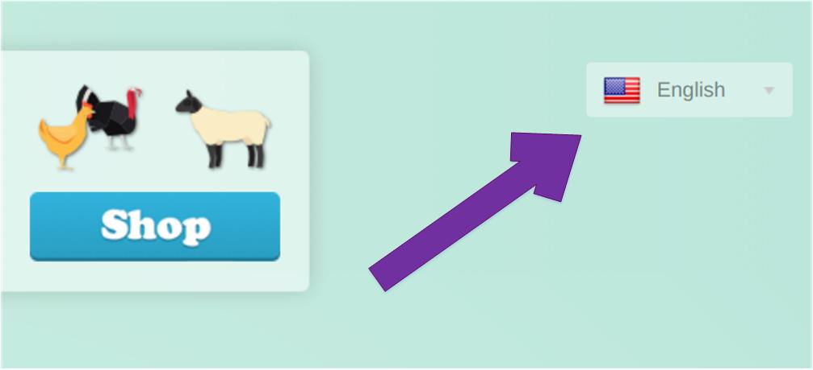

**_Задание 3_**: *Опишите user flow пользователя при покупке виртуального товара в PayStation до ввода платежных реквизитов включительно. Для выполнения задания обратитесь к демо: [livedemo.xsolla.com/paystation](livedemo.xsolla.com/paystation).*

# Покупка виртуального товара в Xsolla PayStation
Перед началом покупок убедитесь, что выбран нужный язык интерфейса. Для смены языка интерфейса нажмите кнопку с указанием языка в правом верхнем углу . В раскрывающемся меню выберите требуемый язык.  

()
## Приступая к покупке
1. Нажмите кнопку **Shop**. Вы окажетесь на странице магазина;
2. Выберите предмет покупки в левой части страницы магазина. В магазине PayStation можно выбрать товары двух категорий:
     + **Домашние любимцы** – товары этой категории можно купить только за виртуальную валюту;
     + **Еда** – товары этой категории можно купить только за реальную валюту.
## Процесс покупки
### Покупка Домашнего любимца
1. Выберите категорию **Домашние любимцы** в левой части страницы магазина;
2. Выберите необходимый товар;
3. Нажмите кнопку с указанием цены в правой нижней части блока с описанием нужного товара. Цены на товары этой категории указаны в игровой валюте;
4. Если на вашем балансе достаточно игровой валюты для покупки товара, товар будет куплен. Если игровой валюты недостаточно, в верхней части диалогового окна появится сообщение: “Недостаточный баланс для совершения операции”;
5. Чтобы осуществить покупку, [пополните баланс игровой валюты](#aaa) и повторите действия, начиная с №1.
### Покупка Еды
1. Выберите категорию **Еда** в левой части страницы магазина;
2. Выберите необходимый товар;
3. Нажмите кнопку с указанием цены в правой нижней части блока с описанием нужного товара. Цены на товары этой категории указаны в реальной валюте. Вы окажетесь на странице **Способы оплаты**;
4. Выберите подходящий способ оплаты и введите платежные реквизиты.
### Как подарить Еду
1. Выберите категорию **Еда** в левой части страницы магазина;
2. Выберите необходимый товар;
3. Нажмите кнопку с изображением подарка () в правой нижней части блока с описанием нужного товара. Товары этой категории можно купить только за реальную валюту. Вы окажетесь на странице **Купить в подарок**;
4. В раскрывающемся списке **Подарок для** выберите пользователя, которому собираетесь сделать подарок. При необходимости введите сообщение в окне **Сообщение”**;
5. Нажмите кнопку **Подтвердить** в правой нижней части страницы. Вы окажетесь на странице **Способы оплаты**;
6. Выберите требуемый способ оплаты и введите платежные реквизиты.
## Баланс валюты
### <a name="aaa"><a/>Пополнение баланса игровой валюты
#### Покупка пакета игровой валюты
1. В меню в верхней части магазина выберите категорию **Игровая валюта**. Вы окажетесь на странице **Игровая валюта**;
2. Выберите подходящий пакет игровой валюты и нажмите кнопку **Купить** в нижней части блока с описанием пакета. Вы окажетесь на странице **Способы оплаты**;
3. Выберите требуемый способ оплаты и введите платежные реквизиты.
#### <a name="aab"><a/>Покупка произвольного количества игровой валюты
1. В меню в верхней части магазина выберите категорию **Игровая валюта**. Вы окажетесь на странице **Игровая валюта**;
2. Выберите строку **Произвольное количество виртуальной валюты** в верхней правой части страницы. Вы окажетесь на другой странице **Игровая валюта**;
3. Укажите требуемое количество игровой валюты в левой части калькулятора. Цена игровой валюты в реальной валюте будет пересчитана автоматически;
4. Нажмите кнопку **Далее”** в нижней правой части страницы. Вы окажетесь на странице **Способы оплаты**;
5. Выберите требуемый способ оплаты и введите платежные реквизиты.
### Подарок игровой валюты
1. В меню в верхней части магазина выберите категорию **Игровая валюта**. Вы окажетесь на странице **Игровая валюта**;
2. Выберите подходящий пакет игровой валюты и нажмите кнопку с изображением подарка () в нижней части блока с описанием пакета. Если готовые пакеты игровой валюты вам не подходят, выберите строку **Произвольное количество виртуальной валюты** и [следуйте указаниям](#aab). Вы окажетесь на странице **Купить в подарок**;
3. В раскрывающемся списке **Подарок для** выберите пользователя, которому собираетесь сделать подарок. При необходимости введите сообщение в окне **Сообщение”**;
4. Нажмите кнопку **Подтвердить** в правой нижней части страницы. Вы окажетесь на странице **Способы оплаты**;
5. Выберите требуемый способ оплаты и введите платежные реквизиты.
